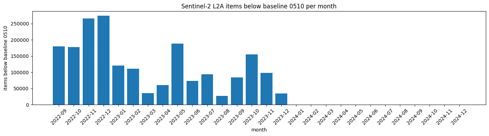
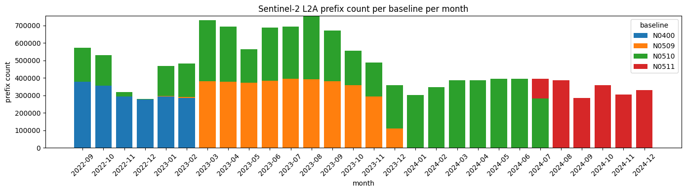

# Monthly prefix analysis

Runs `analyze` on every `prefixes-*.parquet` file in the project root and plots:

1. A bar chart of items with a processing baseline below 0510 per month.
2. A stacked bar chart of prefix counts per baseline per month.


```python
import re
from pathlib import Path

import matplotlib.pyplot as plt

from mspc_sentinel_2_check import Analysis, analyze
```


```python
root = Path.cwd().parent
pattern = re.compile(r"^prefixes-(\d{4})-(\d{2})\.parquet$")
results: dict[str, Analysis] = {}
for path in sorted(root.glob("prefixes-*.parquet")):
    match = pattern.match(path.name)
    if match is None:
        continue
    year, month = match.groups()
    results[f"{year}-{month}"] = analyze(str(path))
list(results)
```


    ['2022-09',
     '2022-10',
     '2022-11',
     '2022-12',
     '2023-01',
     '2023-02',
     '2023-03',
     '2023-04',
     '2023-05',
     '2023-06',
     '2023-07',
     '2023-08',
     '2023-09',
     '2023-10',
     '2023-11',
     '2023-12',
     '2024-01',
     '2024-02',
     '2024-03',
     '2024-04',
     '2024-05',
     '2024-06',
     '2024-07',
     '2024-08',
     '2024-09',
     '2024-10',
     '2024-11',
     '2024-12']


## Items below baseline 0510 per month


```python
labels = list(results.keys())
values = [r.below_baseline_0510 for r in results.values()]
fig, ax = plt.subplots(figsize=(max(6, len(labels) * 0.5), 4))
ax.bar(labels, values)
ax.set_xlabel("month")
ax.set_ylabel("items below baseline 0510")
ax.set_title("Sentinel-2 L2A items below baseline 0510 per month")
ax.tick_params(axis="x", rotation=45)
fig.tight_layout()
plt.show()
```


    

    


## Prefix count per baseline per month


```python
baselines = sorted({b for r in results.values() for b in r.by_baseline})
fig, ax = plt.subplots(figsize=(max(6, len(labels) * 0.5), 4))
bottom = [0] * len(labels)
for baseline in baselines:
    counts = [results[m].by_baseline.get(baseline, 0) for m in labels]
    ax.bar(labels, counts, bottom=bottom, label=baseline)
    bottom = [b + c for b, c in zip(bottom, counts)]
ax.set_xlabel("month")
ax.set_ylabel("prefix count")
ax.set_title("Sentinel-2 L2A prefix count per baseline per month")
ax.tick_params(axis="x", rotation=45)
ax.legend(title="baseline")
fig.tight_layout()
plt.show()
```


    

    

