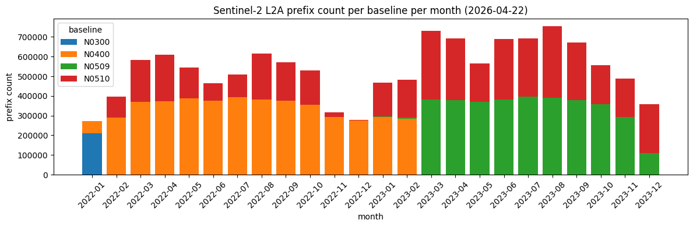
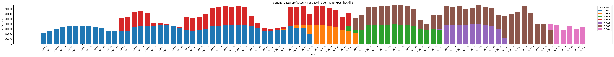

# Monthly prefix analysis

Runs `analyze` on every `prefixes-*.parquet` file in `data/post-backfill/` and plots:

1. A bar chart of items with a processing baseline below 0500 per month.
2. A stacked bar chart of prefix counts per baseline per month.


```python
import re
from pathlib import Path

import matplotlib.pyplot as plt

from mspc_sentinel_2_check import Analysis, analyze
```


```python
snapshot = "post-backfill"
snapshot_dir = Path.cwd().parent / "data" / snapshot
pattern = re.compile(r"^prefixes-(\d{4})-(\d{2})\.parquet$")
results: dict[str, Analysis] = {}
for path in sorted(snapshot_dir.glob("prefixes-*.parquet")):
    match = pattern.match(path.name)
    if match is None:
        continue
    year, month = match.groups()
    results[f"{year}-{month}"] = analyze(str(path))
months = list(results)
months
```


    ['2021-01',
     '2021-02',
     '2021-03',
     '2021-04',
     '2021-05',
     '2021-06',
     '2021-07',
     '2021-08',
     '2021-09',
     '2021-10',
     '2021-11',
     '2021-12',
     '2022-01',
     '2022-02',
     '2022-03',
     '2022-04',
     '2022-05',
     '2022-06',
     '2022-07',
     '2022-08',
     '2022-09',
     '2022-10',
     '2022-11',
     '2022-12',
     '2023-01',
     '2023-02',
     '2023-03',
     '2023-04',
     '2023-05',
     '2023-06',
     '2023-07',
     '2023-08',
     '2023-09',
     '2023-10',
     '2023-11',
     '2023-12',
     '2024-01',
     '2024-02',
     '2024-03',
     '2024-04',
     '2024-05',
     '2024-06',
     '2024-07',
     '2024-08',
     '2024-09',
     '2024-10',
     '2024-11',
     '2024-12']


## When each month's parquet file was created


```python
from datetime import datetime

from IPython.display import HTML

rows = []
for month in months:
    path = snapshot_dir / f"prefixes-{month}.parquet"
    stat = path.stat()
    created = getattr(stat, "st_birthtime", stat.st_mtime)
    rows.append((month, datetime.fromtimestamp(created).strftime("%Y-%m-%d %H:%M:%S")))

table = "<table><tr><th>month</th><th>created</th></tr>"
table += "".join(f"<tr><td>{m}</td><td>{c}</td></tr>" for m, c in rows)
table += "</table>"
HTML(table)
```


<table><tr><th>month</th><th>created</th></tr><tr><td>2021-01</td><td>2026-06-22 10:06:50</td></tr><tr><td>2021-02</td><td>2026-06-22 10:10:26</td></tr><tr><td>2021-03</td><td>2026-06-22 10:14:14</td></tr><tr><td>2021-04</td><td>2026-06-22 10:18:35</td></tr><tr><td>2021-05</td><td>2026-06-22 10:22:39</td></tr><tr><td>2021-06</td><td>2026-06-22 10:26:50</td></tr><tr><td>2021-07</td><td>2026-06-22 10:30:52</td></tr><tr><td>2021-08</td><td>2026-06-22 10:35:01</td></tr><tr><td>2021-09</td><td>2026-06-22 10:39:14</td></tr><tr><td>2021-10</td><td>2026-06-22 10:43:24</td></tr><tr><td>2021-11</td><td>2026-06-22 13:51:54</td></tr><tr><td>2021-12</td><td>2026-06-22 14:00:07</td></tr><tr><td>2022-01</td><td>2026-06-22 07:26:45</td></tr><tr><td>2022-02</td><td>2026-06-22 07:30:20</td></tr><tr><td>2022-03</td><td>2026-06-22 07:34:02</td></tr><tr><td>2022-04</td><td>2026-06-22 07:38:19</td></tr><tr><td>2022-05</td><td>2026-06-22 07:42:27</td></tr><tr><td>2022-06</td><td>2026-06-22 08:28:20</td></tr><tr><td>2022-07</td><td>2026-06-22 08:32:37</td></tr><tr><td>2022-08</td><td>2026-06-22 08:52:52</td></tr><tr><td>2022-09</td><td>2026-06-22 08:57:13</td></tr><tr><td>2022-10</td><td>2026-06-22 09:01:29</td></tr><tr><td>2022-11</td><td>2026-06-22 09:05:44</td></tr><tr><td>2022-12</td><td>2026-06-22 09:09:24</td></tr><tr><td>2023-01</td><td>2026-06-18 15:38:48</td></tr><tr><td>2023-02</td><td>2026-06-18 15:42:36</td></tr><tr><td>2023-03</td><td>2026-06-18 15:46:28</td></tr><tr><td>2023-04</td><td>2026-06-18 15:50:52</td></tr><tr><td>2023-05</td><td>2026-06-18 15:55:00</td></tr><tr><td>2023-06</td><td>2026-06-18 15:59:15</td></tr><tr><td>2023-07</td><td>2026-06-18 16:03:22</td></tr><tr><td>2023-08</td><td>2026-06-18 16:07:37</td></tr><tr><td>2023-09</td><td>2026-06-18 16:11:54</td></tr><tr><td>2023-10</td><td>2026-06-18 16:16:11</td></tr><tr><td>2023-11</td><td>2026-06-22 06:39:18</td></tr><tr><td>2023-12</td><td>2026-06-22 06:43:01</td></tr><tr><td>2024-01</td><td>2026-06-18 14:10:36</td></tr><tr><td>2024-02</td><td>2026-06-18 14:14:19</td></tr><tr><td>2024-03</td><td>2026-06-18 14:18:12</td></tr><tr><td>2024-04</td><td>2026-06-18 14:22:31</td></tr><tr><td>2024-05</td><td>2026-06-18 14:26:33</td></tr><tr><td>2024-06</td><td>2026-06-18 14:30:36</td></tr><tr><td>2024-07</td><td>2026-06-18 14:34:40</td></tr><tr><td>2024-08</td><td>2026-06-18 14:38:51</td></tr><tr><td>2024-09</td><td>2026-06-18 14:43:06</td></tr><tr><td>2024-10</td><td>2026-06-18 14:46:33</td></tr><tr><td>2024-11</td><td>2026-06-18 14:50:47</td></tr><tr><td>2024-12</td><td>2026-06-18 14:54:32</td></tr></table>


## Items below baseline 0500 per month


```python
values = [results[m].below_baseline_0500 for m in months]
fig, ax = plt.subplots(figsize=(max(6, len(months) * 0.5), 4))
ax.bar(months, values)
ax.set_xlabel("month")
ax.set_ylabel("items below baseline 0500")
ax.set_title(f"Sentinel-2 L2A items below baseline 0500 per month ({snapshot})")
ax.tick_params(axis="x", rotation=45)
fig.tight_layout()
plt.show()
```


    

    


## Prefix count per baseline per month


```python
baselines = sorted({b for r in results.values() for b in r.by_baseline})
fig, ax = plt.subplots(figsize=(max(6, len(months) * 0.5), 4))
bottom = [0] * len(months)
for baseline in baselines:
    counts = [results[m].by_baseline.get(baseline, 0) for m in months]
    ax.bar(months, counts, bottom=bottom, label=baseline)
    bottom = [b + c for b, c in zip(bottom, counts)]
ax.set_xlabel("month")
ax.set_ylabel("prefix count")
ax.set_title(f"Sentinel-2 L2A prefix count per baseline per month ({snapshot})")
ax.tick_params(axis="x", rotation=45)
ax.legend(title="baseline")
fig.tight_layout()
plt.show()
```


    

    

